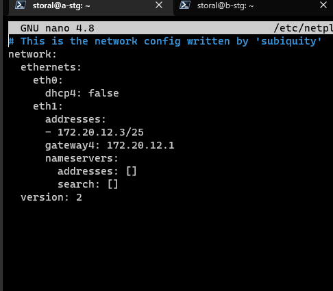
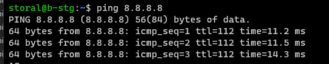
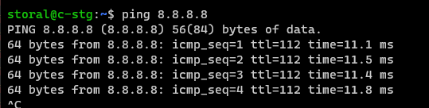

# Práctica PR1101. Configuración de red en Linux

En esta práctica debes indicar el comando que introducirías en Bash para realizar lo que se pide en cada uno de los puntos. Debes introducir la respuesta en el espacio reservado para código después de cada punto.

Para descargar este archivo en formato `md` hazlo desde la url `https://vgonzalez165.github.io/apuntes_iso/UT11_Linux_Instalacion/11_pr1101.md`


## Ejercicio 2: Múltiples redes

Vamos a hacer ahora un ejercicio algo más complicado en el que configuraremos varios equipos en diferentes redes.

Vas a necesitar 4 máquinas virtuales con Ubuntu Server, por lo que el primer paso será realizar tres clonaciones de la máquina que instalamos el primer día. Como probablemente estás utilizando Hyper-V no tendrás problema ya que, al clonar una máquina, le asigna una nueva dirección MAC. Si usaras algún otro hipervisor asegúrate de que las máquinas tengas diferentes direcciones MAC.

**1.- Cambiar los nombres de equipos**

Lo primero de todo, vamos a cambiar los nombres de equipo de todos los servidores, que se identificarán por una letra y tus iniciales. En mi caso serían `a-vjgr`, `b-vjgr`, `c-vjgr` y `d-vjgr`.

Para cambiar el nombre de equipo en Ubuntu Server hay que hacerlo con el comando hostnamectl mediante la siguiente orden:

```
$ sudo hostnamectl set-hostname nuevo_nombre
```

Tras hacerlo, también hay que modificar el fichero `/etc/hosts`, reemplazando el nombre antiguo por el nuevo. No es necesario reiniciar el equipo para que se apliquen estos cambios.

**2.- Configurar un servidor como router**

La otra cosa que necesitarás para esta práctica es configurar un servidor como enrutador. Para ello hay que realizar dos pasos, habilitar el **forwarding** y configurar **iptables** para que reenvíe todos los paquetes que lleguen por un enlace a otro.

Para habilitar el forwarding simplemente debes editar el fichero `/etc/sysctl.conf` y añadir (o descomentar) la línea `net.ipv4.ip_forward=1`. Luego aplicas los cambios ejecutando el comando `sysctl -p`

La configuración de iptables se sale del ámbito de este módulo, así que simplemente limítate a copiar las siguientes líneas en el Shell de Ubuntu.

```
$ sudo iptables -F
$ sudo iptables -t nat -A POSTROUTING --out-interface {interfaz_salida} -j MASQUERADE
$ sudo iptables -A FORWARD --in-interface {interfaz-entrada} -j ACCEPT
```

La estructura de red que queremos representar es la siguiente:


 
Como puedes apreciar, tenemos cuatro servidores, tres con una interfaz de red (que en Hyper  configurarás en modo red interna) y un cuarto servidor que funcionará como enrutador, por lo que tendrá tres interfaces de red: una conectada al *default switch*  para dar salida a Internet y otras dos en modo red interna que se conectarán a las dos subredes que tenemos.

Las IPs de las subredes del ejemplo son orientativas y no son las que tienes que utilizar tú. Tú tienes asignada la red 172.20.X.0/24, donde X es tu número de equipo y tendrás que extraer dos direcciones de subred de dicha red para asignarlas a los equipos.

Entrega: 

1. Debes indicar qué subredes has utilizado, señalando qué IPs has asignado a cada equipo.

```
Subred 1: 172.20.12.0/25
    - d-stg (router): 172.20.12.1
    - Equipo local: 172.20.12.2
    - a-stg: 172.20.12.3
    - b-stg: 172.20.12.4
Subred 2: 172.20.12.128/25
    - d-stg (router): 172.20.12.129
    - Equipo local: 172.20.12.130
    - c-stg: 172.20.12.131
```

2. Captura de los ficheros de configuración de netplan de los cuatro equipos.

```
a-stg:
```

```
b-stg:
```

```
c-stg:
```

```
d-stg (router):
```


1. Captura desde los 3 equipos de un ping hacia el enrutador, hacia el otro equipo de la red (solo en el caso de la primera red) y hacia una dirección de internet (por ejemplo, la IP 8.8.8.8)

```
a-stg:
```


```
b-stg:
```



```
c-stg:
```



```
d-stg:
```


## Ejercicio 3: Experimentando con la tabla ARP

Ahora vamos a trabajar con la tabla ARP de los equipos de la red anterior. Realiza las siguientes tareas:

1.- Muestra la tabla ARP del equipo A (el que está en una subred con otro equipo). Explica qué indica cada una de las líneas que se muestran.


```
-La primera hace referencia a la MAC asociada a la IP del host que funciona como router.
-La segunda vine del adaptado de red por defecto (default switch) que no tiene nada que ver con este ejercicio.
-La tercera es el registro (IP+MAC) de la maquina física que previamente se ha configurado para realizar una conexión por ssh.
```

2.- Elimina todas las entradas de la tabla ARP del equipo


```
*Se han borrado todos los registros pero el de la maquina física se ha vuelto a guardar por la conexión ssh
```

3.- Añade manualmente la entrada ARP con la IP y MAC del equipo que hace de enrutador (equipo D)


4.- Comprueba que lo has hecho bien haciendo un ping al equipo D


5.- ¿Cuándo crees que se añadirán automáticamente más entradas a la tabla ARP? Justifica tu respuesta

```
Ahora mismo solo se puede añadir la entrada ARP correspondiente a la otra máquina que pertenece a la red, mientras esta red no se amplie. Esta entrada ARP se guardará automáticamente en el momento en que se comunique la máquina A con la máquina B (por ejemplo haciendo ping de A a B).
```

6.- Elimina cualquier entrada de la tabla ARP que no sea la del enrutador. Haz un ping al otro equipo de la red (equipo B). ¿Qué cambios ha habido en la tabla ARP? ¿Por qué?


```
Se ha añadido a la tabla ARP la IP y la MAC asociadas al equipo B, porque ha enviado un mensaje broadcast con la dirección ip que el router descartaría y el equipo B respondería con su MAC, con lo que el equipo A ya tiene su tabla ARP completa porque no hay más dispositivos conectado a esta subred, para dirigirse a cualquier equipo fuera de la red enviará los paquetes por el router.
```

7.- ¿Qué crees que pasaría si introducimos una entrada errónea en la entrada ARP? Por ejemplo, si poner la IP de un equipo y la MAC de otro diferente. Justifica tu respuesta.

```
Para el ordenador será imposible comunicarse con el equipo que tiene registrado con una IP y MAC que no corresponden ya que enviará paquetes con una IP y MAC asociadas que no concuerdan con ningún equipo, es decir, si se tiene la IP de un equipo asociada a una MAC que no es la del mismo no se podrá comunicar con el mismo. 
```


